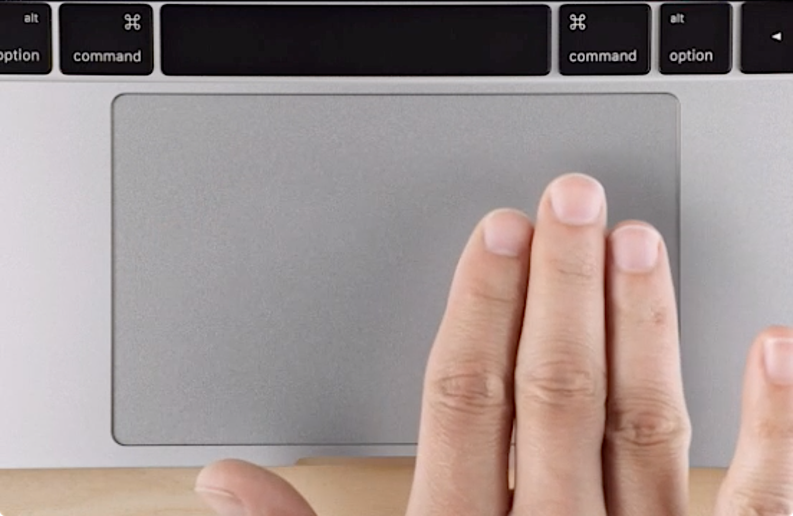

<a href="https://github.com/artginzburg/MiddleClick/releases">
  
</a>

<div align="center">
  <h1>
    MiddleClick 
  </h1>
  <p>
    <b>Emulate a scroll wheel click with three finger Click or Tap on MacBook trackpad and Magic Mouse</b>
  </p>
  <p>
    with <b>macOS</b> Sequoia<a href="https://www.apple.com/macos/macos-sequoia/"><sup>15</sup></a> support!
  </p>
  <br>
</div>

> [!NOTE]
> ## 🏁 MiddleClick is finished
>
> It stays here, free and GPL-3.0, and `brew install --cask middleclick` keeps working. Nothing
> removed, no nags, no telemetry.
>
> The middle click it gave you — three-finger click and three-finger tap — is **free forever in
> [WheelClick](https://wheelclick.app/?ref=middleclick-readme)**, its from-scratch successor, built
> on the documented, supported part of macOS.
>
> [The full story →](https://github.com/artginzburg/MiddleClick/issues/174)
<br>



<h2 align="right">:mag: Usage</h2>

<blockquote align="right">

It's more than just `⌘`+click

</blockquote>

<p align="right">

`System-wide` · close tabs by middleclicking on them

</p>

<p align="right">

`In Safari` · middleclicking on a link opens it in the background as a new tab

</p>

<p align="right">

`In Terminal` · paste selected text

</p>

<br>

## Install

### Via :beer: [Homebrew](https://brew.sh) (Recommended)

```ps1
brew install --cask middleclick
```

> Check out [the cask](https://github.com/Homebrew/homebrew-cask/blob/master/Casks/m/middleclick.rb) if you're interested

### <a href="https://github.com/artginzburg/MiddleClick/releases/latest/download/MiddleClick.zip">Direct Download · </a>

If you've used v1 or v2 — glance over [How to migrate](./docs/MIGRATIONS.md).

<br>

## Preferences

### Hide Status Bar Item

> This is a native macOS feature — works the same for any app.

1. Hold `⌘` and drag the icon away from the menu bar until you see :heavy_multiplication_x:
2. Release

To bring it back — just open MiddleClick again while it's already running.

### Number of Fingers

- Want to use 4, 5 or 2 fingers for middleclicking? No trouble. Even 10 is possible.
- **Note:** setting `fingers` to `2` will conflict with normal two-finger right-clicks and single-finger clicks.

```ps1
defaults write art.ginzburg.MiddleClick fingers 4
```

> Default is 3

### Allow to click with more than the defined number of fingers.

- This is useful if your second hand accidentally touches the touchpad.
- Unfortunately, this does not serve as a palm rejection technique for huge touchpads.

```ps1
defaults write art.ginzburg.MiddleClick allowMoreFingers true
```

> Default is false, so that the number of fingers is precise

### Tapping preferences

#### Max Distance Delta

- The maximum distance the cursor can travel between touch and release for a tap to be considered valid.
- The position is normalized and values go from 0 to 1.

```ps1
defaults write art.ginzburg.MiddleClick maxDistanceDelta 0.03
```

> Default is 0.05

#### Max Time Delta

- The maximum interval in milliseconds between touch and release for a tap to be considered valid.

```ps1
defaults write art.ginzburg.MiddleClick maxTimeDelta 150
```

> Default is 300

## Troubleshooting

- [Accessibility permissions not working after an update](./docs/troubleshooting.md#accessibility-permissions-not-working-after-an-update)
- [Antivirus / CleanMyMac false positive](./docs/troubleshooting.md#antivirus--cleanmymac-flags-middleclick-as-adware)
- [Three Finger Drag conflicts](./docs/three-finger-drag.md)

## Building from source

> Assuming you have `Command Line Tools` installed

1. Clone the repo
2. Run `make`
3. You'll get a `MiddleClick.app` in `./build/`

## Credits

Created by [Clément Beffa](https://clement.beffa.org/),<br/>
fixed by [Alex Galonsky](https://github.com/galonsky) and [Carlos E. Hernandez](https://github.com/carlosh),<br/>
revived by [Pascâl Hartmann](https://github.com/LoPablo),<br/>
maintained by [Arthur Ginzburg](https://github.com/artginzburg)
